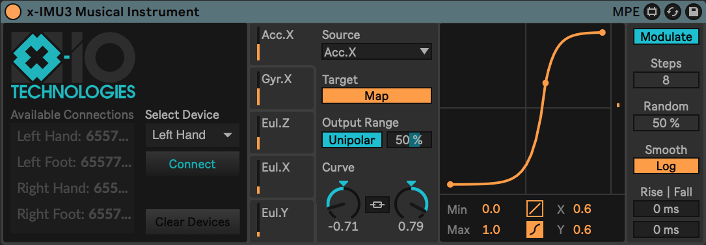

# x-IMU3 Musical Instrument

The x-IMU3 (by x-IO Technologies) is a wearable sensor that measures acceleration, rotational velocity, and orientation. This repository provides a Max4Live device that combines the x-IMU3 Max MSP Example with Ableton Live's "Expression Control", simplifying the process of setting up custom mappings from movement parameters to sound parameters.

Currently, it only supports a single device connectino per computer, but future versions will 

# Progress Tracker
- [X] Add x-imu3.maxpat to ExpressionControl
    - "p x-imu3"
- [X] Edit "p x-imu3"
    - Split into individual, labelled values
    - e.g. accel.x, accel.y, ...
- [X] Add output matching "p MidiLogic"
    - (symbol int) source, value
- [X] Update dropdown menus, s/r ---selectedSignal, and coll ---signalTags
    - To match x-imu3 labels
- [X] Rescale to range 0-1...
    - inputs
    - plots/processing
    - outputs
- [X] Add x-IMU3 UI components to presentation mode
- [ ] Reduce to minimal set of features for desired functionality (remove vestigle functions from templates and development process)
- [ ] Add timeseries input/output plots
- [ ] Add support for multiple device connections
